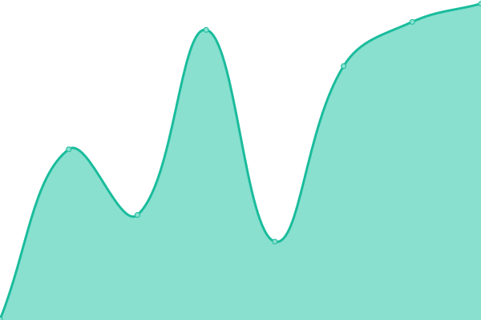

# [📈 Live Status](https://status.isledocs.com): <!--live status--> **🟩 All systems operational**

This repository contains the open-source uptime monitor and status page for [Integrated Statistics Learning Environment](http://stat.cmu.edu/isle/), powered by [Upptime](https://github.com/upptime/upptime).

With [Upptime](https://upptime.js.org), you can get your own unlimited and free uptime monitor and status page, powered entirely by a GitHub repository. We use [Issues](https://github.com/isle-project/status/issues) as incident reports, [Actions](https://github.com/isle-project/status/actions) as uptime monitors, and [Pages](https://demo.upptime.js.org) for the status page.

<!--start: status pages-->
<!-- This summary is generated by Upptime (https://github.com/upptime/upptime) -->
<!-- Do not edit this manually, your changes will be overwritten -->
<!-- prettier-ignore -->
| URL | Status | History | Response Time | Uptime |
| --- | ------ | ------- | ------------- | ------ |
|  [ISLE Documentation](https://isledocs.com) | 🟩 Up | [isle-documentation.yml](https://github.com/isle-project/status/commits/HEAD/history/isle-documentation.yml) | 

 195ms
     
 | 

<a href="https://status.isledocs.com/history/isle-documentation">100.00%</a>
    

|  [ISLE Website](https://stat.cmu.edu/isle) | 🟩 Up | [isle-website.yml](https://github.com/isle-project/status/commits/HEAD/history/isle-website.yml) | 

 688ms
     
 | 

<a href="https://status.isledocs.com/history/isle-website">100.00%</a>
    

|  [CMU Statistics & Data Science ISLE Instance](https://isle.stat.cmu.edu/ping) | 🟩 Up | [cmu-statistics-and-data-science-isle-instance.yml](https://github.com/isle-project/status/commits/HEAD/history/cmu-statistics-and-data-science-isle-instance.yml) | 

 201ms
     
 | 

<a href="https://status.isledocs.com/history/cmu-statistics-and-data-science-isle-instance">100.00%</a>
    

|  [CMU Heinz College ISLE Instance](https://isle.heinz.cmu.edu/ping) | 🟩 Up | [cmu-heinz-college-isle-instance.yml](https://github.com/isle-project/status/commits/HEAD/history/cmu-heinz-college-isle-instance.yml) | 

 340ms
     
 | 

<a href="https://status.isledocs.com/history/cmu-heinz-college-isle-instance">100.00%</a>
    

|  [Kymetis ISLE Instance](https://isle.kymetis.com/ping) | 🟩 Up | [kymetis-isle-instance.yml](https://github.com/isle-project/status/commits/HEAD/history/kymetis-isle-instance.yml) | 

 306ms
     
 | 

<a href="https://status.isledocs.com/history/kymetis-isle-instance">100.00%</a>
    

<!--end: status pages-->

[**Visit our status website →**](https://status.isledocs.com)

## 📄 License

- Powered by: [Upptime](https://github.com/upptime/upptime)
- Code: [MIT](./LICENSE) © [Integrated Statistics Learning Environment](http://stat.cmu.edu/isle/)
- Data in the `./history` directory: [Open Database License](https://opendatacommons.org/licenses/odbl/1-0/)
